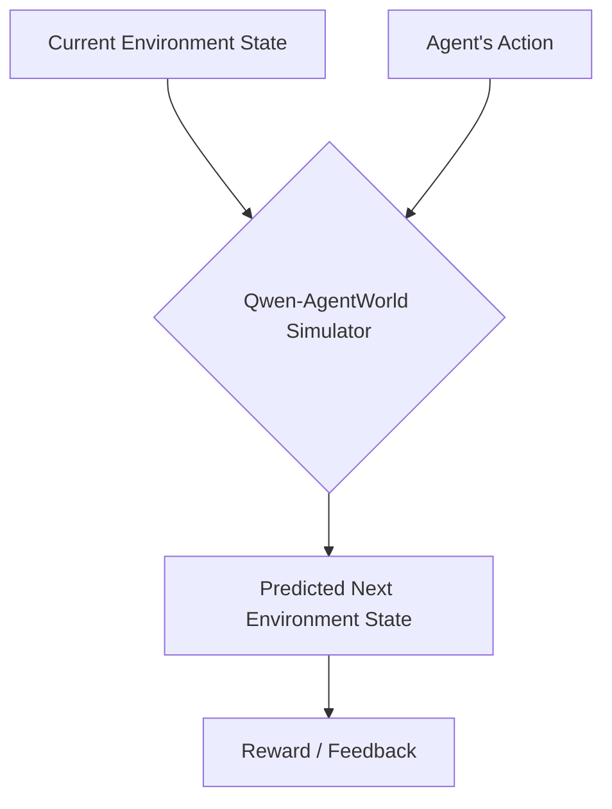

# Qwen-AgentWorld: Language World Models for General Agents

## 🌟 Simple Explanation
Imagine an AI that doesn't just chat, but actually understands cause and effect in the digital world. **Qwen-AgentWorld** is a special kind of AI called a "Language World Model." Instead of just predicting the next word in a sentence, it predicts the next *state of the world*. 

If you give it a current computer screen (or text environment) and an action an agent takes, it accurately simulates what happens next. It acts as a digital playground or simulator for training other AI agents!

## 📊 How It Works (Diagram)

## 🧠 Architecture & Methodology
- **Unified Modeling:** The researchers created the first language model capable of simulating *seven* distinct domains within a single architecture (MCP, Search, Terminal, SWE, Web, OS, Android). 
- **Text-Based GUI Simulation:** Instead of taking heavy image pixel inputs for UI environments, the model cleverly uses accessibility trees and view hierarchies. This maintains a highly efficient, purely text-based interface without losing structural layout context.
- **Model Architecture:** The models utilize a Mixture-of-Experts (MoE) architecture for efficient scaling. 
  - *Qwen-AgentWorld-35B-A3B:* 35 Billion total parameters (3 Billion active per token).
  - *Qwen-AgentWorld-397B-A17B:* Massive 397 Billion total parameters (17 Billion active per token).

## 🛠 Training Pipeline
The models were trained on over **10 million real-world interaction trajectories** using an advanced three-stage pipeline to perfect their simulation abilities:
1. **CPT (Continual Pre-training):** Injects general-purpose world modeling capabilities using state transition dynamics and professional corpora.
2. **SFT (Supervised Fine-Tuning):** Activates "next-state-prediction" reasoning by training the model to output long chain-of-thought traces before making a state prediction.
3. **RL (Reinforcement Learning):** Sharpens the simulation fidelity using a tailored framework that employs hybrid rubric-and-rule rewards so the simulated world behaves exactly like the real one.

## 📈 Results & Performance
- **AgentWorldBench:** The team introduced this benchmark to evaluate simulation quality across five dimensions.
- **State-of-the-Art:** The flagship *Qwen-AgentWorld-397B-A17B* achieved the highest overall score on AgentWorldBench (58.71), reportedly outperforming frontier models like GPT-5.4 (which scored 58.25).
- **Decoupled Simulation & Warm-up:** AI agents trained purely inside this Qwen simulated environment showed performance gains exceeding those trained in real environments. Furthermore, using world-model training as a pre-training "warm-up" significantly boosted performance across seven downstream agentic benchmarks.

## 🔗 Resources
- **ArXiv ID:** [2606.24597](https://arxiv.org/abs/2606.24597)
- **GitHub:** [QwenLM/Qwen-AgentWorld](https://github.com/QwenLM/Qwen-AgentWorld)
