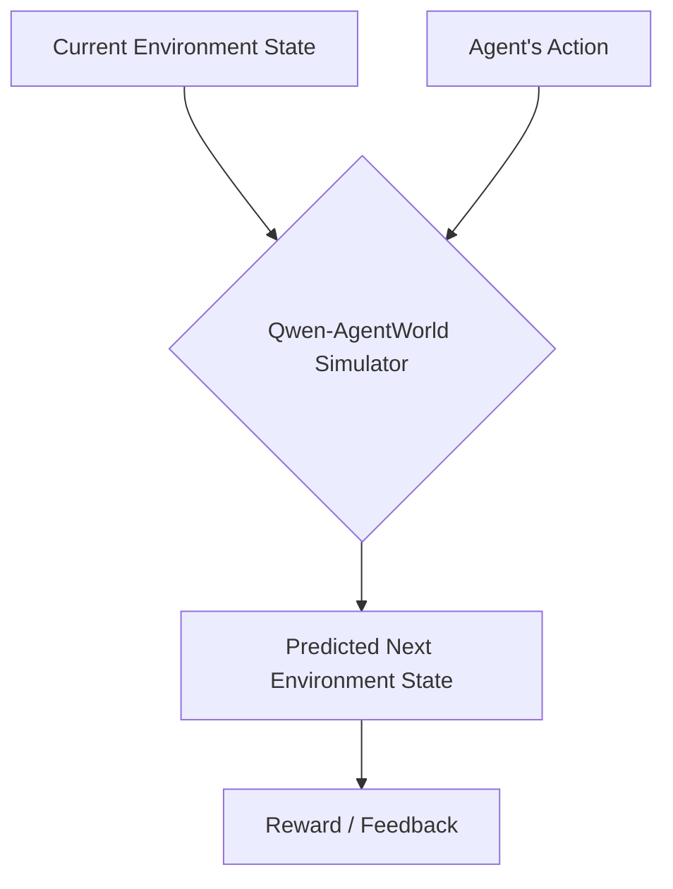

# Qwen-AgentWorld: Language World Models for General Agents

## 🌟 Simple Explanation
Imagine an AI that doesn't just chat, but actually understands cause and effect in the digital world. **Qwen-AgentWorld** is a special kind of AI called a "Language World Model." Instead of just predicting the next word in a sentence, it predicts the next *state of the world*. 

If you give it a current computer screen (or text environment) and an action an agent takes, it accurately simulates what happens next. It acts as a digital playground or simulator for training other AI agents!

## 📊 How It Works (Diagram)

## 🧠 Key Innovations & Training Pipeline
The model was trained in three specialized stages to perfect its simulation abilities:
1. **CPT (Continued Pre-training):** Gives the model general-purpose world modeling and physics understanding.
2. **SFT (Supervised Fine-Tuning):** Teaches the model how to reason about next-state predictions accurately.
3. **RL (Reinforcement Learning):** Sharpens the simulation fidelity using hybrid rewards so the simulated world behaves exactly like the real one.

## 📈 Metrics & Full Details
- **ArXiv ID:** [2606.24597](https://arxiv.org/abs/2606.24597)
- **Supported Domains:** The model simulates 7 distinct domains spanning both text-based and GUI-based interfaces:
  - *Text-based:* MCP, Search, Terminal, Software Engineering (SWE)
  - *GUI-based:* Web, Operating System (OS), Android
- **Model Sizes:** Released in massive scale variants, including **35B** and **397B** parameter models.
- **AgentWorldBench:** The researchers also released a comprehensive benchmark built from real-world interactions to evaluate how well language models can simulate these environments.
- **Use Cases:** Can be used as a decoupled environment simulator for Reinforcement Learning (RL) or as a pre-training foundation to make other agent models smarter.

## 🔗 Resources
- **GitHub:** [QwenLM/Qwen-AgentWorld](https://github.com/QwenLM/Qwen-AgentWorld)
